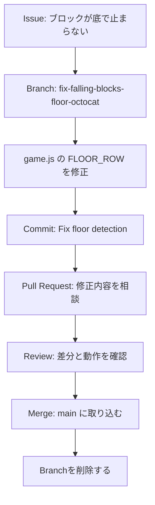
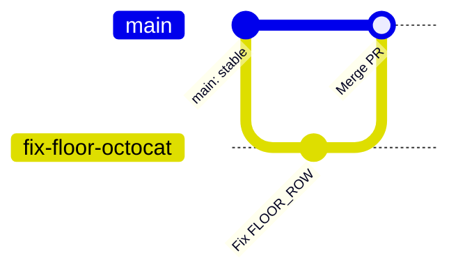

# GitHub Flow

> ℹ️ GitHub Flow は、GitHub 公式ドキュメントで説明されている **軽量なブランチベースのワークフロー**です。
> `main` を安定した状態に保ちながら、作業 Branch で変更し、Pull Request で相談・確認してから取り込みます。
>
> 参考: [GitHub フロー - GitHub Docs](https://docs.github.com/ja/get-started/using-github/github-flow)

本教材では既定ブランチを `main` と表記します。
画面上で `master` と表示される場合は、`main` を `master` に読み替えてください。

## 1. GitHub Flow の全体像

GitHub Flow は、番号を暗記するものではありません。
**main から作業 Branch が分かれ、Pull Request で確認して、Merge で main に戻る**流れです。

```mermaid
flowchart LR
    main1((main)) --> branch[Branchを作る]
    branch --> change[変更する]
    change --> commit[Commitしてpushする]
    commit --> pr[Pull Requestを作る]
    pr --> review[Reviewコメントに対応する]
    review --> merge[Mergeする]
    merge --> delete[Branchを削除する]
    delete --> main2((main))

    classDef main fill:#2f81f7,color:#fff,stroke:#2f81f7;
    classDef work fill:#1c2330,color:#e6edf3,stroke:#3fb950;
    classDef pr fill:#1c2330,color:#e6edf3,stroke:#d29922;
    class main1,main2 main;
    class branch,change,commit,delete work;
    class pr,review,merge pr;
```



公式の GitHub Flow は次の流れです。

| 公式ステップ | 目的 | この教材での例 |
| --- | --- | --- |
| Branch を作成する | `main` に影響を与えず作業する場所を作る | `fix-falling-blocks-floor-<github-id>` を作る |
| 変更を加える | Branch 上で必要な修正を行う | `app/falling-blocks/game.js` を修正する |
| Pull Request を作成する | 変更についてフィードバックを求める | バグ修正 PR を作る |
| Review コメントに対処する | 質問・提案・指摘に応じて追加修正する | `FLOOR_ROW` の変更を確認・必要なら修正する |
| Pull Request を Merge する | 承認された変更を `main` に取り込む | 修正を `main` に反映する |
| Branch を削除する | 完了した作業 Branch を誤って使わないようにする | `fix-falling-blocks-floor-<github-id>` を削除、または削除してよい状態にする |

> 📝 本ワークショップでは、公式ステップの前に **Issue を作る** 手順を入れます。
> Issue は GitHub Flow の必須ステップではありませんが、初心者が「何のための変更か」を見失わないようにするため、作業の入口として使います。

## 2. 前提と使える操作手段

公式ドキュメントでは、GitHub Flow に従う前提として GitHub アカウントとリポジトリが必要だと説明されています。
この教材でも前提事項は同じです。

- GitHub アカウントを持っている
- 作業するリポジトリを開ける
- Issues と Pull requests を使える

GitHub Flow の操作は、次のどれでも実行できます。

| 操作手段 | この教材での扱い |
| --- | --- |
| GitHub Web UI | Issue・Pull Request・Review・Merge で使う |
| ローカル Git + VSCode | コードの修正・commit・push で使う（基本編） |
| GitHub CLI `gh` | clone / push / PR作成をかんたんにする（推奨・任意） |
| GitHub Desktop | 本教材では扱わないが、同じ考え方で実行できる |

## 3. この教材での題材

今回のハンズオンでは、Falling Blocks アプリの「ブロックが底で止まらず落ち続ける」バグを GitHub Flow で修正します。



修正対象は以下です。

```text
app/falling-blocks/game.js
```

修正内容は、底の位置を表す定義を直すことです。

```javascript
const FLOOR_ROW = Number.POSITIVE_INFINITY;
```

を、次のように変更します。

```javascript
const FLOOR_ROW = ROWS - 1;
```

## 4. Step 1: Branch を作成する

Branch は、`main` に影響を与えずに作業するための場所です。
公式ドキュメントでは、短くわかりやすい Branch 名を使うことが勧められています。
Branch 名を見るだけで、コラボレーターが「何の作業中か」を理解できるようにします。

この教材で使う Branch 名:

```text
fix-falling-blocks-floor-<github-id>
```

良い Branch 名の考え方:

| 観点 | 例 |
| --- | --- |
| 何をするかが分かる | `fix-falling-blocks-floor-octocat` |
| 短く具体的 | `fix-readme-typo` |
| 作業単位が1つに絞られている | `add-login-validation` |

避けたい Branch 名:

| Branch 名 | 避けたい理由 |
| --- | --- |
| `work` | 何の作業かわからない |
| `test` | 目的が曖昧 |
| `fix` | 何を直すのかわからない |

Branch を作ることで、`main` を壊さずに変更できます。
間違えた場合も、Branch 上で追加修正したり、変更を戻したりできます。

## 5. Step 2: 変更を加えて Commit する

作業 Branch 上で必要な変更を加えます。
この教材では、`game.js` の `FLOOR_ROW` を修正します。

公式ドキュメントでは、変更を Commit して push することにより、作業がリモートに保存され、他の人が確認・質問・提案できるようになると説明されています。
Web UI の基本編では、画面上の **Commit changes** がこの操作にあたります。

Commit message の例:

```text
Fix Falling Blocks floor detection
```

良い Commit の考え方:

- 何を変更したかが短く分かる
- 1つの Commit に、関連するひとまとまりの変更だけを入れる
- 後から見た人が、なぜその変更があるのか追いやすい

このハンズオンでは、変更を `app/falling-blocks/game.js` の底判定修正に絞ります。
 unrelated changes を混ぜないことで、レビュー担当者が差分を確認しやすくなります。

## 6. Step 3: Pull Request を作成する

Pull Request は、作業 Branch の変更を `main` に取り込んでよいか相談する場所です。
公式ドキュメントでは、Pull Request を使ってコラボレーターにフィードバックを依頼すると説明されています。

Pull Request 作成時に書くこと:

| 書くこと | この教材での例 |
| --- | --- |
| 変更の概要 | Falling Blocks の底判定を修正した |
| 解決する問題 | ブロックが盤面の外へ落ち続ける |
| 関連 Issue | `Closes #<issue-number>` |
| 見てほしい点 | `FLOOR_ROW` が最後の行を指しているか |

Pull Request の向き:

| 表示 | 意味 | このハンズオンでの例 |
| --- | --- | --- |
| base | 変更を取り込みたい先 | `main` |
| compare | 取り込みたい変更が入っている Branch | `fix-falling-blocks-floor-<github-id>` |

```text
base: main  ←  compare: fix-falling-blocks-floor-<github-id>
```

逆向きにすると、「main の内容を作業 Branch に取り込む」意味になってしまいます。

Pull Request の本文例:

```markdown
## Summary / 変更概要

Falling Blocks の底の判定を修正した。

## Related issue / 関連Issue

Closes #<issue-number>

## Review points / レビュー観点

- [ ] FLOOR_ROW が盤面のいちばん下の行を指している
- [ ] ブロックが盤面の底で止まる
- [ ] Files changed に関係のない変更が混ざっていない
```

`Closes #<issue-number>` のように書くと、Pull Request が Merge されたときに関連 Issue を閉じられます。
公式ドキュメントでも、Pull Request と Issue をリンクすると関係者が変更の背景を追いやすくなると説明されています。

早めに相談したい場合は Draft Pull Request を使うこともできます。
ただし、本ワークショップでは操作を増やしすぎないため、通常の Pull Request を作ります。

## 7. Step 4: Review コメントに対処する

Review は、Pull Request の変更を他の人が確認し、質問・コメント・提案を残す場です。
公式ドキュメントでは、レビュー担当者が Pull Request 全体、特定のファイル、特定の行にコメントできると説明されています。

この教材で見る場所:

| 場所 | 見ること |
| --- | --- |
| Conversation | PR の説明、レビューコメント、履歴 |
| Files changed | `game.js` の差分 |
| Checks | 自動チェック結果。基本編では必須にしない |

レビューコメントの例:

```text
FLOOR_ROW が ROWS - 1 になっていることを確認しました。
```

```text
Files changed に unrelated changes がないことを確認しました。
```

```text
ローカルで確認したら、ブロックが底で止まりました。
```

レビューコメントをもらったら、必要に応じて Branch に追加 Commit を行います。
Pull Request は同じ Branch の新しい Commit を自動的に反映するため、同じ PR の中で会話と修正を続けられます。

> 🔑 **ポイント**: Review は責める場ではありません。
> 変更の意図を共有し、安心して Merge するための会話です。

## 8. Step 5: Pull Request を Merge する

Pull Request が承認され、問題がなければ Merge します。
Merge によって、作業 Branch の変更が `main` に反映されます。

Merge 前に確認すること:

- Pull Request の向きが `base: main` / `compare: fix-falling-blocks-floor-<github-id>` になっている
- Files changed に不要な変更が混ざっていない
- Review コメントを確認している
- 関連 Issue が PR 本文に書かれている
- `FLOOR_ROW` が `ROWS - 1` になっている

公式ドキュメントでは、Pull Request にはコメントと Commit の履歴が残るため、あとから変更の背景を理解しやすくなると説明されています。
これは、GitHub Flow の大事な価値です。

Merge できない場合に確認すること:

| 状態 | 意味 |
| --- | --- |
| conflict / 競合 | 同じ場所に別の変更があり、GitHub が自動で統合できない |
| required review | 必要な承認レビューがまだ足りない |
| failing checks | 自動チェックが失敗している |
| permission issue | Merge する権限がない |

基本編では、これらが出た場合は講師に相談します。
実務では、Branch protection / Ruleset によって、レビュー数やチェック結果などの条件を満たすまで Merge がブロックされることがあります。

## 9. Step 6: Branch を削除する

Pull Request を Merge したら、作業 Branch を削除します。
公式ドキュメントでは、Branch を削除することで「その Branch での作業が完了した」ことを示し、古い Branch を誤って使うことを防げると説明されています。

Branch を削除しても、次の情報は消えません。

- Pull Request の会話
- Review コメント
- Commit 履歴
- Merge された変更

そのため、Merge 後に `fix-falling-blocks-floor-<github-id>` Branch を削除しても、`main` に入った修正は消えません。

## 10. main と Branch の関係をもう一度見る



この図で大事なのは、作業中の変更が `main` から分かれた場所で進み、Review 後に戻ってくることです。

## 11. このワークショップでの運用ルール

- main に直接変更しない
- 1つの Issue に対して 1つの Branch を作る
- Pull Request は小さく作る
- Files changed で差分を確認する
- Review コメントには丁寧に返信する
- Merge 後は不要になった Branch を削除する、または削除してよい状態にする

## 12. 初心者がつまずきやすい点

| つまずき | 考え方 |
| --- | --- |
| commit と PR の違いがわからない | commit は保存ポイント、PR は相談と確認の場所 |
| branch が難しい | main から分けた自分専用の作業場所と考える |
| base / compare がわからない | base は取り込み先、compare は取り込みたい変更 |
| review が怖い | 責める場ではなく、チームで品質を上げる会話の場 |
| merge のタイミングがわからない | 目的の変更が終わり、レビューで問題がなければ merge |
| branch を削除すると変更が消えそう | Merge 後なら変更は main に入り、PR と Commit の履歴も残る |
