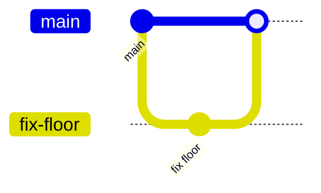

# GitHub と Git の基本

> ℹ️ 本書は、Git / GitHub 未経験者が最初につまずきやすい言葉を整理するための資料です。

## 1. Git と GitHub の違い

| 名前 | 役割 | たとえ |
| --- | --- | --- |
| Git | ファイルの変更履歴を記録する仕組み | セーブポイントを作れるノート |
| GitHub | Git の履歴を共有し、チームで作業するサービス | みんなで見られる作業場所 |

Git は「履歴を記録する道具」です。
GitHub は「その履歴をチームで共有し、レビューや相談をする場所」です。

基本編では、最初から Git コマンドを覚える必要はありません。
まず GitHub の画面上で Issue → Branch → Commit → Pull Request → Review → Merge の流れを体験し、あとから CLI 編で同じ考え方をコマンドに対応づけます。

## 2. Repository

Repository は、プロジェクトのファイルと変更履歴をまとめて置く場所です。

このワークショップでは、リポジトリを「教材用の作業場所」として使います。

## 3. main

main は、チームにとって「今の正しい状態」を表す基準のブランチです。

このワークショップでは main に直接変更せず、作業用の Branch から Pull Request を通して変更を入れます。

## 4. Issue

Issue は、これからやること・目的・相談を記録する場所です。

作業を始める前に Issue を作ると、「何のための変更か」を Pull Request と結びつけて残せます。

## 5. Branch

Branch は、main の作業場所から分かれて安全に変更するための作業線です。



main に直接変更を入れるのではなく、ブランチで試してから Pull Request で確認します。

## 6. Commit

Commit は、変更を履歴として保存する単位です。

よい commit の考え方:

- ひとまとまりの変更にする
- 後から見て何をしたかわかるメッセージを書く
- 大きすぎる変更を避ける

例:

```text
Fix Falling Blocks floor detection
```

## 7. Pull Request

Pull Request（PR）は、自分のブランチの変更を main に取り込んでよいか相談する場所です。

Pull Request でできること:

- 変更差分を見る
- コメントで相談する
- レビューを依頼する
- CI やチェック結果を見る
- 問題なければ Merge する

## 8. Review

Review は、Pull Request の変更を他の人が確認してコメントすることです。

レビューは「間違い探し」だけではなく、作業内容の確認、意図の共有、チームでの合意形成の場です。

## 9. Merge

Merge は、ブランチの変更を main に取り込む操作です。

ワークショップでは、レビュー後に Pull Request を Merge して、変更が main に入ることを確認します。

## 10. 最初に覚える用語まとめ

| 用語 | 一言でいうと |
| --- | --- |
| Repository | プロジェクトの置き場所 |
| main | チームにとっての基準となる状態 |
| Issue | やること・目的・相談の記録 |
| Branch | 安全に作業するための分岐 |
| Commit | 変更の保存ポイント |
| Pull Request | 変更を取り込む前の相談場所 |
| Review | 変更内容の確認 |
| Merge | 変更を main に取り込むこと |

## 11. 画面でよく出る補助用語

| 用語 | 一言でいうと | 出てくる場所 |
| --- | --- | --- |
| diff / 差分 | 変更前と変更後の違い | Pull Request の **Files changed** |
| base | 変更を取り込みたい先 | Pull Request 作成画面 |
| compare | 取り込みたい変更が入っている Branch | Pull Request 作成画面 |
| clone | GitHub 上のリポジトリを手元にコピーすること | CLI 編 |
| pull | GitHub 側の最新変更を手元に取り込むこと | CLI 編 |
| push | 手元の commit を GitHub に送ること | CLI 編 |
