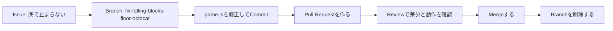

# ワークショップ全体設計 — GitHub Basic

> ℹ️ 本書は Git / GitHub 初心者向けワークショップの全体設計です。
> 受講者が Git に不慣れでも進められるよう、コードの修正は VSCode で行い、必要な git コマンドは手順書で1つずつ案内します。Issue・Pull Request・Review・Merge は GitHub（ブラウザ）で行います。

## 1. 目的

このワークショップの目的は、GitHub の機能を個別に覚えることではなく、
**GitHub Flow を使ったチーム開発の流れ**を体験として理解することです。

本日のゴール:

- GitHubを使った基本の開発の流れを理解すること

受講後に目指す状態:

- Git と GitHub の違いを説明できる
- Repository / Issue / Branch / Commit / Pull Request / Review / Merge の役割を説明できる
- Issue から Branch を作り、Commit、Pull Request、Review を経て main へ取り込む流れを実行できる
- 変更を直接 main に入れず、ブランチで分ける理由を理解できる

## 2. 対象者

| 項目 | 想定 |
| --- | --- |
| Git 経験 | 未経験または clone / commit という言葉を聞いたことがある程度 |
| GitHub 経験 | GitHub アカウントを持っている |
| 開発経験 | 問わない。テキストファイル編集だけで参加可能 |
| 必要環境 | ブラウザのみ |

## 3. 実施形式

| 形式 | 内容 |
| --- | --- |
| 座学 | GitHub の概念、基本機能、GitHub Flow を説明 |
| 講師デモ | 画面を見せながら Issue → PR → Merge を一度通す |
| 個人演習 | 受講者が自分のブランチで簡易アプリのバグを修正 |
| ペアレビュー | 参加者同士で Pull Request を確認しコメントする |
| まとめ | 実務での使い方、次に学ぶ機能を整理 |

## 4. タイムテーブル（約75分）

> ℹ️ 環境構築（Git / VSCode / GitHub認証）は**事前準備（約30〜45分）**として実施し、下の時間には含みません（[00. 環境構築](../onboarding/00-setup.md)）。座学（M1+M2）は要点に絞り、時間はハンズオン体験に寄せています。時間に余裕がある場合は、CLI 版ハンズオンや追加課題（2回目の Commit / Request changes → 再レビュー）で深掘りできます。

| 時間 | セクション | 要点 |
| --- | --- | --- |
| 事前 | 環境構築（事前準備） | Git / VSCode / GitHub認証を用意する（約30〜45分・別途） |
| 0:00-0:05 | はじめに | 今日のゴール、GitHub を使う理由 |
| 0:05-0:20 | M1 Git / GitHub の基本 | Git と GitHub、Repository、Issue、Branch、Commit、Pull Request、Review、Merge |
| 0:20-0:30 | M2 GitHub Flow | main から分岐し、PR で戻す開発の型 |
| 0:30-0:38 | 講師デモ | Falling Blocks のバグ修正を一度実演 |
| 0:38-1:05 | M3 ハンズオン | Issue(GitHub) → clone/VSCode修正 → Commit/Push → PR → Review → Merge |
| 1:05-1:10 | ペアレビュー | 隣の人の Pull Request を Review する |
| 1:10-1:15 | M4 まとめ | 今日の学び、CLI、Actions、ブランチ保護、Pages への接続 |

## 5. 教材ストーリー

本ワークショップでは、Falling Blocks アプリの「ブロックが底で止まらず落ち続ける」バグを修正するシナリオを使います。

この題材は、修正対象を1行に絞りながら、初心者でも「Issueにする理由」「Branchで直す理由」「Pull Requestで差分を見る理由」を確認しやすいことを重視しています。

## 6. 基本編で扱う範囲

基本編では、自分のPCの VSCode での修正と、GitHub 上の Issue / PR / Review / Merge を組み合わせた以下の機能に絞ります。

- Repository
- Issue
- Branch
- Commit
- Pull Request
- Pull Request Review
- Markdown

以下は発展・任意扱いにします。

- GitHub Actions
- GitHub Pages
- Branch protection / Ruleset
- GitHub CLI
- GitHub Advanced Security
- Organization 横断の管理機能

> 🎯 **判断基準**: 最初の体験では GitHub Flow の本筋に集中すること。自動化や統制は「次に学ぶこと」として紹介する。

## 7. 成果物

受講者は最終的に以下を作成します。

- バグ修正用 Issue
- `fix-falling-blocks-floor-<github-id>` 作業 Branch
- `app/falling-blocks/game.js` の修正 Commit
- Pull Request
- Review コメント
- Merge 済みの変更履歴
- Closed になった関連 Issue
- 削除済み、または削除してよい状態の作業 Branch

必達ライン:

- Issue → Branch → Commit → Pull Request → Review → Merge の順番を自分の言葉で説明できる
- 自分の Pull Request の差分を開き、何が変わったかを説明できる

余裕があれば扱うこと:

- CLI で同じ流れを再実行する
- GitHub Actions や Branch protection / Ruleset がどこで役立つかを紹介する

## 8. 事前準備

講師は以下を確認します。

- [ ] 受講者が事前に環境構築（**Git / VSCode / GitHub認証**）を済ませている（[00. 環境構築](../onboarding/00-setup.md) を事前に案内）
- [ ] 受講者がアクセスできるリポジトリを用意する
- [ ] Issues が有効であることを確認する
- [ ] 受講者に書き込み権限を付与する、または fork 方式にする
- [ ] 受講者が clone / push できる（認証が通る）ことを確認する
- [ ] `app/falling-blocks/` が存在し、アプリを表示できることを確認する
- [ ] Issue / Pull Request テンプレートが表示されることを確認する
- [ ] 講師用のデモ PR を1つ用意する

## 9. 発展編への接続

基本編では git の clone / commit / push を使います。発展編（02）では、Pull Request の作成まで含めて `gh` CLI で完結させ、よりコマンド中心に同じ流れを再実行します。

- `git clone`
- `git switch -c`
- `git add`
- `git commit`
- `git push`
- Pull Request 作成

CLI 編は必須にせず、参加者の理解度や時間に応じて扱います。

### ローカル開発オンボーディング編（Phase 1）

基本編でも VSCode を使ったローカル開発（clone / 編集 / commit / push）は体験します。
この発展トラックでは、実務でつまずきやすい **コンフリクト解消** や **やり直し（undo）** まで含めて、
自分の PC で開発を続けられる状態を目指します。独立したトラックを [`onboarding/`](../onboarding/README.md) に用意しています。

| ページ | 内容 |
| --- | --- |
| [00. 環境構築](../onboarding/00-setup.md) | 必要ツール（Git / エディタ / ターミナル / gh）と GitHub 認証をそろえる（**基本編の事前準備でもある**） |
| [01. ローカル開発サイクル](../onboarding/01-local-flow.md) | clone → 編集 → add → commit → push → Merge → main 更新 |
| [02. コンフリクト解決](../onboarding/02-conflicts.md) | 衝突の読み方・直し方・予防 |
| [03. やり直し・復旧](../onboarding/03-undo-recovery.md) | amend / restore / revert / reset の使い分け |

> 環境構築（00）は基本編の事前準備として最初に案内します。01〜03 は基本編のあとの発展として扱います。
> ローカル環境がなくても基本編は完結するため、この編は任意の発展として位置づけます。
