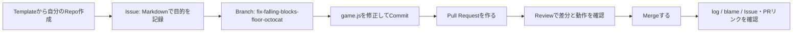

# ワークショップ全体設計 — GitHub Basic

> ℹ️ 本書は Git / GitHub 初心者向けワークショップの全体設計です。
> 受講者が Git に不慣れでも進められるよう、コードの修正は VSCode で行い、必要な git コマンドは手順書で1つずつ案内します。Issue・Pull Request・Review・Merge は GitHub（ブラウザ）で行います。

## 1. 目的

このワークショップの目的は、GitHub の機能を個別に覚えることではなく、
**Repository作成からMerge後の履歴確認まで、基本の開発の流れを1本の体験として理解すること**です。

本日のゴール:

- GitHubを使った基本の開発の流れを理解すること

受講後に目指す状態:

- Git と GitHub の違いを説明できる
- Templateから自分のRepositoryを作り、Review相手と共同作業を始められる
- Repository / Issue / Branch / Commit / Pull Request / Review / Merge の役割を説明できる
- MarkdownでIssueを書き、Branch、Commit、Pull Request、Reviewを経てmainへ取り込める
- 変更を直接 main に入れず、ブランチで分ける理由を理解できる
- `git log` / `git blame` とIssue・PRのリンクから変更理由をたどれる

## 2. 対象者

| 項目 | 想定 |
| --- | --- |
| Git 経験 | 未経験または clone / commit という言葉を聞いたことがある程度 |
| GitHub 経験 | GitHub アカウントを持っている |
| 開発経験 | 問わない。テキストファイル編集だけで参加可能 |
| 必要環境 | ブラウザ + Git / VSCode、または Codespaces |

## 3. 実施形式

| 形式 | 内容 |
| --- | --- |
| 座学 | GitHub の概念、基本機能、GitHub Flow を説明 |
| 講師デモ | Templateから練習Repoを作る操作と、完成形の流れを短く見せる |
| 個人演習 | 受講者がTemplateから自分の練習Repoを作り、簡易アプリのバグを修正 |
| ペアレビュー | Collaboratorとして招待したペアとPR URLを交換し、差分を確認する |
| まとめ | 実務での使い方、次に学ぶ機能を整理 |

## 4. タイムテーブル（基本編 約105〜120分）

> ℹ️ 基本編には環境構築30〜45分を含みます。事前に済ませた場合、当日セッションは約75分です。コンフリクトとやり直しは基本編の後の任意発展（+20分）に分けます。

| 目安 | セクション | 要点 |
| --- | --- | --- |
| 5分 | はじめに | 今日のゴールと、1つのRepoで最後まで進めるストーリー |
| 30〜45分 | 環境構築 | ローカル（Git / VSCode / 認証）または Codespaces を選ぶ |
| 20分 | M1 / M2 基本 | GitとGitHub、用語、main→Branch→PR→Review→Merge |
| 10分 | M3-1 Repo / Issue | TemplateからRepo作成、Collaborator、Markdown、Label、Assignee |
| 15分 | M3-2 Branch / Commit | clone / Codespaces、バグ確認、Branch、修正、Commit / Push |
| 12分 | M3-3 PR / Review | Closes、Reviewer指定、Files changed、ペアReview |
| 8分 | M3-4 Merge / 履歴 | Merge、Issue Close、Branch削除、log / blame / 検索 |
| 5分 | M4 まとめ | 体験した流れを言語化し、次の学習へつなぐ |
| +20分（任意） | 発展 | コンフリクト解決・やり直し／復旧 |

## 5. 教材ストーリー

本ワークショップでは、Templateから参加者ごとに練習Repoを作り、Falling Blocks アプリの「ブロックが底で止まらず落ち続ける」バグを修正します。別教材へ移動せず、Merge後の履歴確認まで同じRepoで進めます。

この題材は、修正対象を1行に絞りながら、Repository・Markdown・通知・Issue・Branch・PR・Review・履歴を1本の文脈で確認できることを重視しています。

## 6. 基本編で扱う範囲

基本編では、自分のPCの VSCode での修正と、GitHub 上の Issue / PR / Review / Merge を組み合わせた以下の機能に絞ります。

- Repository
- Template Repository
- Issue
- Branch
- Commit
- Pull Request
- Pull Request Review
- Markdown
- Label / Assignee / @メンション / 通知
- Collaborator
- Codespaces（ローカルの代替）
- 履歴検索（log / blame / Issue・PRの相互リンク）

以下は発展・任意扱いにします。

- GitHub Actions
- GitHub Pages
- Branch protection / Ruleset
- GitHub CLI
- GitHub Advanced Security
- Organization 横断の管理機能
- コンフリクト解消・やり直し（基本編の後に+20分で実施可能）

> 🎯 **判断基準**: 最初の体験では GitHub Flow の本筋に集中すること。自動化や統制は「次に学ぶこと」として紹介する。

## 7. 成果物

受講者は最終的に以下を作成します。

- バグ修正用 Issue
- `github-basic-practice-<github-id>` 練習Repository
- Review相手へのCollaborator招待
- `fix-falling-blocks-floor-<github-id>` 作業 Branch
- `app/falling-blocks/game.js` の修正 Commit
- Pull Request
- Review コメント
- Merge 済みの変更履歴
- Closed になった関連 Issue
- 削除済み、または削除してよい状態の作業 Branch
- `git log` / `git blame` で確認できる変更履歴

必達ライン:

- Repository作成 → Issue → Branch → Commit → Pull Request → Review → Merge → 履歴確認を自分の言葉で説明できる
- 自分の Pull Request の差分を開き、何が変わったかを説明できる

余裕があれば扱うこと:

- CLI で同じ流れを再実行する
- GitHub Actions や Branch protection / Ruleset がどこで役立つかを紹介する

## 8. 事前準備

講師は以下を確認します。

- [ ] 受講者が事前に環境構築（**Git / VSCode / GitHub認証**）を済ませている（[00. 環境構築](../onboarding/00-setup.md) を事前に案内）
- [ ] 練習Template [`Tachaan/github-basic-practice`](https://github.com/Tachaan/github-basic-practice) が Public / Template / default `main` である
- [ ] TemplateにFalling Blocksの意図的なバグとIssue / PR Templateが入っている
- [ ] 参加者のReviewペアを決め、GitHub IDを交換している
- [ ] 各自がPublic Repoを作るか、Collaborator招待を承認できる
- [ ] 受講者が clone / push できる（認証が通る）ことを確認する
- [ ] `app/falling-blocks/` が存在し、アプリを表示できることを確認する
- [ ] Issue / Pull Request テンプレートが表示されることを確認する
- [ ] 講師用の練習Repo・Issue・PRを1つ用意する

## 9. 発展編への接続

基本編では git の clone / commit / push を使います。発展編（02）では、Pull Request の作成まで含めて `gh` CLI で完結させ、よりコマンド中心に同じ流れを再実行します。

- `git clone`
- `git switch -c`
- `git add`
- `git commit`
- `git push`
- Pull Request 作成

CLI 編は必須にせず、参加者の理解度や時間に応じて扱います。

### ローカル開発オンボーディング編（Phase 1）

基本編でも VSCode を使ったローカル開発（clone / 編集 / commit / push）は体験します。
この発展トラックでは、実務でつまずきやすい **コンフリクト解消** や **やり直し（undo）** まで含めて、
自分の PC で開発を続けられる状態を目指します。独立したトラックを [`onboarding/`](../onboarding/README.md) に用意しています。

| ページ | 内容 |
| --- | --- |
| [00. 環境構築](../onboarding/00-setup.md) | 必要ツール（Git / エディタ / ターミナル / gh）と GitHub 認証をそろえる（**基本編の事前準備でもある**） |
| [01. ローカル開発サイクル](../onboarding/01-local-flow.md) | clone → 編集 → add → commit → push → Merge → main 更新 |
| [02. コンフリクト解決](../onboarding/02-conflicts.md) | 衝突の読み方・直し方・予防 |
| [03. やり直し・復旧](../onboarding/03-undo-recovery.md) | amend / restore / revert / reset の使い分け |

> 環境構築（00）は基本編の事前準備として最初に案内します。01〜03 は基本編のあとの発展として扱います。
> ローカル環境がなくても基本編は完結するため、この編は任意の発展として位置づけます。
