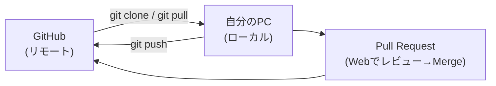
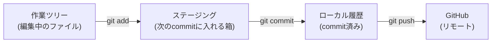

# 01. ローカル開発サイクル — clone → 編集 → commit → push

> ℹ️ このページは **ローカル開発オンボーディング編（Phase 1）** の中心です。
> [00. 環境構築](00-setup.md) が終わっている前提で進めます（Git・エディタ・認証が用意済み）。

> 📝 既定ブランチは `main` と表記します。画面上で `master` の場合は読み替えてください。

---

## 0. 全体像 — ローカルとリモートの往復

ローカル開発は「**クラウド（GitHub）から取ってきて → 手元で直して → クラウドへ返す**」の繰り返しです。



手元（ローカル）の中にも、変更が進む3つの場所があります。ここが Git 最大のつまずきポイントです。



> 🔑 **キーメッセージ**: `add` は「commit に**含める変更を選ぶ**」操作、
> `commit` は「選んだ変更を**履歴に固定する**」操作、
> `push` は「固定した履歴を**クラウドへ送る**」操作です。3つは役割が違います。

---

## 1. リポジトリを Clone する（最初の1回）

Clone は「GitHub 上のリポジトリを、丸ごと自分の PC にダウンロードする」操作です。**最初に1回だけ**行います。

```bash
# <owner>/<repo> は実際の値に置き換える
git clone https://github.com/<owner>/<repo>.git
cd <repo>
```

> 💡 GitHub のリポジトリ画面で、緑の **`< > Code`** ボタンを押すと clone 用の URL をコピーできます。
> SSH を設定した人は `git@github.com:<owner>/<repo>.git` を使います。

確認:

```bash
git status
```

`On branch main` `nothing to commit, working tree clean`（または `master`）と出れば成功です。

---

## 2. 作業を始める前に最新を取り込む（pull）

他の人の変更が GitHub 側に入っているかもしれません。**作業を始める前に必ず最新化**します。

```bash
git switch main      # まず main にいることを確認（古い Git は: git checkout main）
git pull             # リモートの最新を手元に取り込む
```

### pull と fetch の違い

| コマンド | 何をする | いつ使う |
| --- | --- | --- |
| `git fetch` | リモートの最新情報を**取得するだけ**（手元のファイルは変えない） | 様子を見たいとき |
| `git pull` | `fetch` ＋ 手元のブランチに**取り込む**（fetch + merge） | 最新にして作業を始めるとき |

> 🔑 **習慣にすること**: 「作業開始前に `git pull`」。これだけでコンフリクトの多くを防げます。

---

## 3. Branch を作る

直接 `main` を編集せず、作業用の Branch を作ります（GitHub Flow の基本）。

```bash
# 新しいブランチを作って、同時に切り替える
git switch -c fix-typo-octocat      # 古い Git は: git checkout -b fix-typo-octocat
```

> 💡 ブランチ名は「何をするか」が分かる名前にします。例: `fix-falling-blocks-floor-octocat`。
> 末尾を自分の GitHub ID にすると、誰の作業か分かりやすくなります。

確認:

```bash
git branch        # 今いるブランチに * が付く
```

---

## 4. ファイルを編集して、状態を見る（status / diff）

エディタ（VS Code など）でファイルを編集します。編集したら、Git で状態を確認します。

```bash
git status        # どのファイルが変わったか
git diff          # 具体的に何行どう変わったか
```

`git status` に出る赤いファイル名は「まだステージングしていない変更」です。

---

## 5. 変更をステージングする（add）

commit に含めたい変更を `add` で選びます（ステージングの箱に入れる）。

```bash
git add app/falling-blocks/game.js    # 特定のファイルだけ
# もしくは
git add .                             # 変更したファイルをすべて
```

確認:

```bash
git status        # ステージした変更は緑色で表示される
```

> 💡 `git add .` は便利ですが、関係ないファイルまで入れがちです。
> 慣れるまでは**ファイルを指定して add** する方が安全です。

---

## 6. Commit する（履歴に固定する）

ステージした変更を、メッセージを付けて履歴に固定します。

```bash
git commit -m "Fix: 底判定を ROWS-1 に修正してブロックが床で止まるようにした"
```

> 🔑 **良いコミットメッセージ**: 「何を・なぜ」変えたかが分かる短い文。
> 例: `Fix: 底判定の FLOOR_ROW を修正` のように、先頭に種類（Fix/Add/Update など）を付けると読みやすいです。

確認:

```bash
git log --oneline -5      # 自分の commit が一番上に出る
```

---

## 7. Push する（GitHub へ送る）

ローカルの commit を GitHub（リモート）へアップロードします。

```bash
# そのブランチを初めて push するとき（-u で追跡を設定）
git push -u origin fix-typo-octocat

# 2回目以降は次だけでOK
git push
```

> 📝 初回 push でブラウザのログイン画面が出たら、[00. 環境構築](00-setup.md) の認証で済ませた通りにログインします。

push が成功すると、GitHub のリポジトリ画面に
`Compare & pull request`（プルリクエストを作成）の案内が出ます。

---

## 8. Pull Request を作って Merge する（Web に橋渡し）

ここから先は基本編と同じ流れです。Web UI で Pull Request を作り、レビューを受けて Merge します。

- 詳しい画面操作: [基本編: Template Repo作成から履歴確認まで](../handson/01-github-flow-web.md) の Step 6 以降
- CLI で PR を作りたい場合:

```bash
gh pr create --fill        # タイトル・本文を commit から自動入力
gh pr view --web           # 作った PR をブラウザで開く
```

> 🔑 ローカルで commit / push しても、**main に反映されるのは Merge した後**です。
> 「push＝完了」ではなく「push → PR → レビュー → Merge」で1サイクルです。

---

## 9. Merge 後、main を最新に保つ（次の作業の準備）

PR が Merge されたら、自分の `main` を最新にして、次の作業に備えます。

```bash
git switch main
git pull                 # Merge された自分の変更を含め、最新を取り込む

# 使い終わった作業ブランチを片付ける（任意）
git branch -d fix-typo-octocat
```

> 💡 これで「main は常に最新・きれい」「作業は毎回新しいブランチで」というリズムになります。
> 次の作業は、また手順3（`git switch -c ...`）から始めます。

---

## 10. 1日の流れ（チートシート）

```bash
# 朝・作業開始前
git switch main
git pull

# 作業用ブランチを作る
git switch -c my-task-octocat

# --- ここで編集する ---

git status                       # 何を変えたか確認
git add <ファイル>               # commit に含める変更を選ぶ
git commit -m "わかりやすい説明"  # 履歴に固定
git push -u origin my-task-octocat   # GitHub へ送る（初回）

# あとは Web / gh で Pull Request → レビュー → Merge

# Merge されたら
git switch main
git pull
```

> 🔑 困ったら、まず `git status`。今どこにいて、何が起きているかをいつも教えてくれます。

---

## 11. Web UI 編との対応表

基本編（Web UI）でやったことは、ローカルでは次のコマンドに対応します。

| やりたいこと | Web UI（基本編） | ローカル（CLI） |
| --- | --- | --- |
| リポジトリを手元に持ってくる | （不要・ブラウザで見る） | `git clone <URL>` |
| 最新を取り込む | （自動・常に最新を表示） | `git pull` |
| Branch を作る | `main ▾` → ブランチ名入力 | `git switch -c <名前>` |
| ファイルを編集する | 鉛筆 ✏️ アイコン | エディタで編集 |
| 変更を記録する | `Commit changes` | `git add` → `git commit` |
| GitHub に送る | （Commit と同時） | `git push` |
| Pull Request を作る | `Compare & pull request` | `gh pr create` |

---

## 12. 次に進む

- 編集がぶつかったときの直し方 → [02. コンフリクト解決](02-conflicts.md)
- 操作を間違えたときのやり直し → [03. やり直し・復旧](03-undo-recovery.md)
- 一覧に戻る → [ローカル開発オンボーディング編 トップ](README.md)
