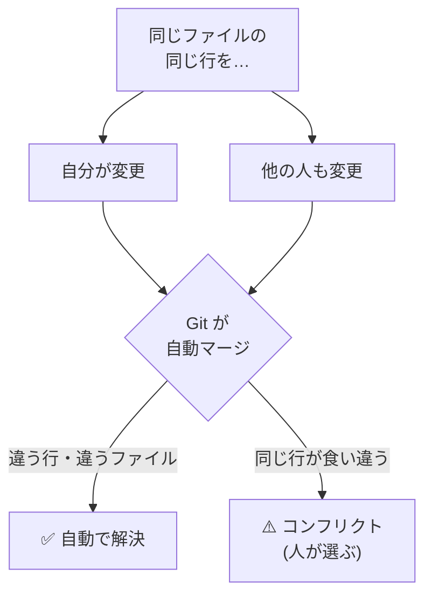

# 02. コンフリクト解決 — 編集がぶつかったとき

> ℹ️ このページは **ローカル開発オンボーディング編（Phase 1）** の応用です。
> [01. ローカル開発サイクル](01-local-flow.md) を理解している前提で進めます。

> 📝 既定ブランチは `main` と表記します。画面上で `master` の場合は読み替えてください。

---

## 0. コンフリクト（衝突）とは

**コンフリクト**は、Git が「どちらの変更を採用すればいいか自動で決められない」状態です。
**エラーではなく、人間に判断を求めているサイン**です。落ち着いて直せば必ず解決できます。



> 🔑 **覚えておくこと**: 違うファイルや違う行への変更は、Git がきれいに合体してくれます。
> コンフリクトになるのは「**同じ行**を別々に変えた」ときだけです。

---

## 1. いつ起きるか

| 場面 | コマンド | 状況 |
| --- | --- | --- |
| 最新を取り込むとき | `git pull` | 自分の変更と、他の人がリモートに入れた変更がぶつかる |
| ブランチを合体するとき | `git merge` | 2つのブランチが同じ行を別々に変えている |
| Pull Request の画面 | （Web） | base ブランチが進んでいて、自動マージできない |

典型的なメッセージ:

```text
CONFLICT (content): Merge conflict in app/falling-blocks/game.js
Automatic merge failed; fix conflicts and then commit the result.
```

これが出たら、あわてず次へ進みます。

---

## 2. コンフリクトマーカーの読み方

コンフリクトしたファイルを開くと、Git が次の印（マーカー）を書き込んでいます。

```text
<<<<<<< HEAD
  const FLOOR_ROW = ROWS - 1;      // ← 自分（今いるブランチ）の変更
=======
  const FLOOR_ROW = ROWS;          // ← 取り込もうとしている側の変更
>>>>>>> main
```

| マーカー | 意味 |
| --- | --- |
| `<<<<<<< HEAD` | ここから下は **自分側** の変更 |
| `=======` | 区切り線（上が自分・下が相手） |
| `>>>>>>> main` | ここまでが **相手側** の変更 |

> 🔑 解決とは、**この3つのマーカーを消して、正しい1つの内容に書き直す**ことです。

---

## 3. 解決する（ローカル）

### 手順

1. どのファイルがコンフリクトしたか確認する。

   ```bash
   git status        # "Unmerged paths" にファイル名が出る
   ```

2. エディタ（VS Code 推奨）でそのファイルを開く。
   VS Code なら `Accept Current Change` / `Accept Incoming Change` /
   `Accept Both Changes` のボタンが各マーカーの上に出ます。

3. **正しい最終形に書き直す**。マーカー（`<<<<<<<` `=======` `>>>>>>>`）を必ず全部消します。

   ```text
   const FLOOR_ROW = ROWS - 1;
   ```

4. 直したファイルをステージングして commit する。

   ```bash
   git add app/falling-blocks/game.js
   git commit            # マージ用のメッセージが既に用意されているので、そのまま保存でOK
   ```

5. リモートへ反映する。

   ```bash
   git push
   ```

> 💡 「自分の変更」か「相手の変更」かの二択とは限りません。
> **両方を活かした第三の正解**に書き直すのが本来の解決です。中身をよく読んで決めましょう。

### 全ファイルが解決できたか確認

```bash
git status        # "Unmerged paths" が消えていればOK
git diff --check  # 残ったマーカーがあれば警告してくれる
```

---

## 4. 解決する（GitHub の Web 画面）

Pull Request の画面で `This branch has conflicts that must be resolved` と出る場合、
かんたんな衝突なら**ブラウザ上で**直せます。

1. PR 画面の **`Resolve conflicts`** ボタンを押す。
2. エディタが開くので、マーカーを消して正しい内容に書き直す。
3. **`Mark as resolved`** を押す。
4. **`Commit merge`** を押す。

> 📝 Web のコンフリクトエディタは「かんたんな衝突」向けです。
> 複雑な場合や不安なときは、ローカル（手順3）で直す方が確実です。

---

## 5. やめて最初からやり直したいとき

途中で混乱したら、マージを**いったん中止**して元の状態に戻せます。

```bash
git merge --abort      # merge 中のコンフリクトを中止して元に戻す
# pull 由来の場合は:
git rebase --abort     # （rebase 中だった場合）
```

> 🔑 「ぐちゃぐちゃになった！」と思っても、**commit していなければ abort で戻せます**。
> まずは深呼吸。それから `git status` で今の状態を確認しましょう。

---

## 6. コンフリクトを減らすコツ（予防）

| コツ | 理由 |
| --- | --- |
| 作業前に必ず `git pull` | 古い状態から始めるほどぶつかりやすい |
| PR は小さく・短命に | 長く伸びたブランチほど他人の変更とずれる |
| 同じファイルを長く抱え込まない | 早めに Merge して共有する |
| こまめに main を取り込む | 差が小さいうちに合わせておく |

> 💡 コンフリクトは「悪いこと」ではなく、共同作業に必ず付いてくる自然な現象です。
> 怖がらず、`status` → マーカーを直す → `add` → `commit` の手順に当てはめれば大丈夫です。

---

## 7. 次に進む

- 操作を間違えたときのやり直し → [03. やり直し・復旧](03-undo-recovery.md)
- ローカル開発サイクルに戻る → [01. ローカル開発サイクル](01-local-flow.md)
- 一覧に戻る → [ローカル開発オンボーディング編 トップ](README.md)
