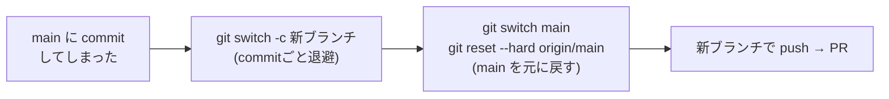

# 03. やり直し・復旧 — 「やっちゃった」を直す

> ℹ️ このページは **ローカル開発オンボーディング編（Phase 1）** の応用です。
> [01. ローカル開発サイクル](01-local-flow.md) を理解している前提で進めます。

> 📝 既定ブランチは `main` と表記します。画面上で `master` の場合は読み替えてください。

> 🔑 **大前提**: Git は履歴を残すツールなので、**たいていの操作はやり直せます**。
> あわてて `reset --hard` などの強い操作をする前に、まず `git status` で状況を確認しましょう。

---

## 0. 「やっちゃった」早見表

まず自分の状況に近い行を探してください。各行のリンク先に手順があります。

| 状況 | 使うもの | リンク |
| --- | --- | --- |
| 直前の commit メッセージを打ち間違えた | `git commit --amend` | [手順1](#1-直前のcommitメッセージを直すamend) |
| `add` したけど、やっぱり commit に入れたくない | `git restore --staged` | [手順2](#2-ステージングを取り消すadd-の取り消し) |
| 編集を全部捨てて元に戻したい | `git restore` | [手順3](#3-編集を捨てて元に戻すまだコミットしてない変更) |
| **main に直接 commit してしまった**（まだ push してない） | ブランチを作って退避 | [手順4](#4-main-に直接commitしてしまったまだ-push-してない) |
| **push 済みの変更を取り消したい** | `git revert` | [手順5](#5-push-済みの変更を打ち消すrevert) |
| commit したけど、まだ push してない変更をまとめ直したい | `git reset --soft` | [手順6](#6-まだ-push-してないローカル-commit-をまとめ直す) |
| 操作を間違えて履歴を見失った | `git reflog` | [手順7](#7-履歴を見失ったら-reflog) |

> ⚠️ **触る前に確認**: `reset --hard` と `push --force` は変更を**消す**力があります。
> 意味が分かるまで使わないでください（[危険なコマンド](#危険なコマンド初心者は基本使わない)を参照）。

---

## 1. 直前の commit メッセージを直す（amend）

まだ push していない直前の commit のメッセージを書き直せます。

```bash
git commit --amend -m "正しいメッセージ"
```

変更し忘れたファイルを「直前の commit に含め直す」こともできます。

```bash
git add 忘れていたファイル
git commit --amend --no-edit     # メッセージはそのまま、内容だけ追加
```

> ⚠️ **push 済みの commit に `--amend` するのは避ける**。履歴が変わり、他の人とずれます。
> push 済みをやり直したいときは [手順5（revert）](#5-push-済みの変更を打ち消すrevert) を使います。

---

## 2. ステージングを取り消す（add の取り消し）

`git add` したけれど、その変更を今回の commit に入れたくない場合。

```bash
git restore --staged app/falling-blocks/game.js
```

ファイルの中身（編集内容）はそのまま残り、「ステージングの箱」から出るだけです。

> 📝 古い Git では `git reset HEAD <ファイル>` が同じ役割です。

---

## 3. 編集を捨てて元に戻す（まだコミットしてない変更）

編集した内容を**捨てて**、最後の commit の状態に戻したい場合。

```bash
git restore app/falling-blocks/game.js     # 1ファイルだけ
git restore .                               # 変更を全部捨てる
```

> ⚠️ **この操作で消えた編集内容は戻せません**（commit していないため）。
> 本当に捨てていいか、`git diff` で中身を確認してから実行してください。

---

## 4. main に直接 commit してしまった（まだ push してない）

「ブランチを切り忘れて main で作業して commit してしまった」よくあるミスです。
**まだ push していなければ**、きれいに直せます。

```bash
# 1. 今の状態のまま、新しいブランチを作って移す
git switch -c fix-my-work-octocat     # commit ごと新ブランチに付いてくる

# 2. main を、間違えて commit する前の状態に戻す
git switch main
git reset --hard origin/main          # リモートの main に合わせる
```

これで「変更は新ブランチに退避」「main は元通り」になります。
あとは新ブランチで push → PR の通常フローに戻れます。



> 🔑 ここで `reset --hard` を使うのは「**戻したい先（origin/main）がはっきりしていて、
> 退避も済んでいる**」からです。状況が曖昧なときは使わないでください。

---

## 5. push 済みの変更を打ち消す（revert）

すでに push（や Merge）してしまった変更を取り消したいとき。
履歴を消すのではなく、**「打ち消す新しい commit」を足す**のが安全なやり方です。

```bash
# 打ち消したい commit のハッシュを調べる
git log --oneline -5

# その commit を打ち消す commit を作る
git revert <commit-hash>
git push
```

> 🔑 `revert` は履歴を書き換えないので、共有済み（push 済み）の変更を取り消すのに**最も安全**です。
> 「消す」のではなく「逆の操作を1つ足す」イメージです。

Web 上でも、Merge 済み Pull Request の画面に **`Revert`** ボタンが出ることがあります。
押すと、打ち消し用の Pull Request を自動で作ってくれます。

---

## 6. まだ push していないローカル commit をまとめ直す

「commit を細かく作りすぎた」「直前の数個をやり直したい」とき（push 前限定）。

```bash
# 直前の2つの commit を取り消して、変更内容はステージングに残す
git reset --soft HEAD~2
# → このあと add 済みの状態になるので、好きな単位で commit し直す
git commit -m "まとめ直したメッセージ"
```

| オプション | commit の取り消し | 編集内容 |
| --- | --- | --- |
| `--soft` | 取り消す | **残す**（ステージング済み） |
| `--mixed`（既定） | 取り消す | **残す**（未ステージング） |
| `--hard` | 取り消す | **消す**（戻せない）⚠️ |

> ⚠️ `reset` で履歴を動かすのは **push 前のローカル commit だけ**にします。
> push 済みを reset すると他の人とずれます。push 済みは [手順5（revert）](#5-push-済みの変更を打ち消すrevert)。

---

## 7. 履歴を見失ったら（reflog）

「reset や切り替えで、さっきの commit がどこかへ行った」ときの最後の頼みが `git reflog` です。
Git は、あなたが移動した足あとをこっそり記録しています。

```bash
git reflog               # 最近いた場所の一覧（HEAD@{0}, HEAD@{1} ...）
git switch -c rescue HEAD@{2}   # 戻りたい時点を新ブランチとして復元
```

> 🔑 「消えた」と思っても、`reflog` でたどれることが多いです。
> 何かおかしくなったら、**新しい操作をする前に**講師に相談してください。

---

## 危険なコマンド（初心者は基本使わない）

| コマンド | 何が起きる | なぜ危険 |
| --- | --- | --- |
| `git reset --hard` | 編集や commit を**消す** | 戻せないことがある。退避してから使う |
| `git push --force` | リモート履歴を**上書き** | 他の人の変更を消すおそれ。共有ブランチでは厳禁 |
| `git clean -fd` | 未追跡ファイルを**削除** | 作りかけのファイルが消える |

> 🔑 これらを使いたくなったら、まず立ち止まって `git status` と `git log --oneline` を確認。
> 不安なら実行せず相談する——それが一番安全な「復旧」です。

---

## 次に進む

- ローカル開発サイクルに戻る → [01. ローカル開発サイクル](01-local-flow.md)
- コンフリクト解決 → [02. コンフリクト解決](02-conflicts.md)
- 一覧に戻る → [ローカル開発オンボーディング編 トップ](README.md)
