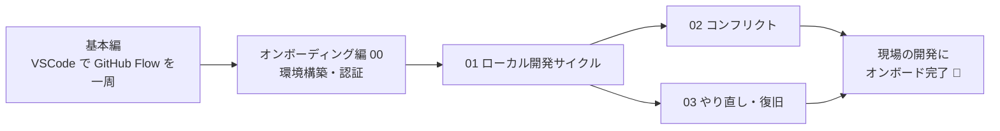

# 🚀 ローカル開発オンボーディング編（Phase 1）

> ℹ️ 基本編でも、VSCode を使ったローカル開発（clone → 編集 → commit → push）は体験します。
> このトラックは、その先の **コンフリクト解消** や **やり直し（undo）** まで含めて、
> **現場の日常開発に自信を持って乗れる**ようにするための発展トラックです。
> 環境構築（[00](00-setup.md)）は基本編の事前準備でもあるので、まだの人はここから始めてください。

> 📝 既定ブランチは `main` と表記します。画面上で `master` の場合は読み替えてください。

---

## 🎯 このトラックのゴール

このトラックを終えると、次ができるようになります。

- 自分の PC に開発ツールをそろえ、GitHub に**安全に接続**できる
- `clone → 編集 → add → commit → push → Pull Request → Merge` を**手元で1周**できる
- 編集が**ぶつかったとき（コンフリクト）**に、落ち着いて直せる
- 操作を**間違えたとき**に、やり直し・復旧の手段を知っている

> 🔑 つまり「基本編で理解した GitHub Flow を、**現場と同じローカル環境で回せる**」状態がゴールです。

---

## 🧰 はじめに：必要なツール（最初に必ず確認）

ローカル開発には、次のツールが必要です。
**まだ何も入っていなくても大丈夫**——[00. 環境構築](00-setup.md) で1つずつ用意します。

| ツール | 役割 | 必須 |
| --- | --- | --- |
| GitHub アカウント | クラウド側の自分の入口 | ✅ |
| Git | 履歴を記録するツール本体 | ✅ |
| コードエディタ（VS Code 推奨） | ファイルを編集する道具 | ✅ |
| ターミナル（OS標準でOK） | コマンドを入力する画面 | ✅ |
| GitHub CLI（`gh`） | 認証・PR作成をかんたんにする | ⭐ 推奨 |

> 🔑 **まずここから**: 何はともあれ [00. 環境構築](00-setup.md) でツールと認証をそろえてください。
> ここが終われば、あとのページはスムーズに進みます。

---

## 📚 学習の順番

上から順に進めるのがおすすめです。

| # | ページ | 内容 | 目安 |
| --- | --- | --- | --- |
| 00 | [環境構築](00-setup.md) | ツール導入・`git config`・GitHub 認証・動作確認（**基本編の事前準備**） | 30–45分 |
| 01 | [ローカル開発サイクル](01-local-flow.md) | 基本編の clone → 編集 → commit → push をコマンド中心に整理し、main更新まで | 30–40分 |
| 02 | [コンフリクト解決](02-conflicts.md) | 衝突の読み方・直し方（ローカル / Web）・予防 | 20–30分 |
| 03 | [やり直し・復旧](03-undo-recovery.md) | amend・restore・revert・reset の使い分け、危険コマンド | 20–30分 |

> 💡 基本編を済ませた人は、**02・03（コンフリクト / やり直し）**がこのトラックの新しい学びです。
> 00・01 は基本編の復習・リファレンスとして使えます。

---

## 🗺️ 基本編との関係

| 観点 | 基本編 | オンボーディング編（このトラック） |
| --- | --- | --- |
| 場所 | VSCode（修正）＋ GitHub（Issue/PR/Review/Merge） | 同じ＋つまずき対応を深掘り |
| 必要なもの | Git・VSCode・認証・ブラウザ | 基本編と同じ |
| 体験 | VSCode で修正し Issue→PR→Merge を1周 | コンフリクト解消・やり直し（undo）まで含めて1周 |
| ねらい | GitHub Flow を手を動かして理解する | 現場の日常開発に自信を持って乗れるようになる |

---

## ✅ 完了チェック（このトラックの修了条件）

- [ ] `git --version` が表示され、`gh auth status`（または SSH 接続）が成功する
- [ ] 自分の PC でリポジトリを `clone` できた
- [ ] ローカルで作ったブランチを `push` し、Pull Request を作って Merge できた
- [ ] コンフリクトマーカー（`<<<<<<<` `=======` `>>>>>>>`）の意味を説明できる
- [ ] 「main に直接 commit してしまった」場合の戻し方を知っている

すべて埋まれば、**基本編＋ローカル開発のオンボーディングは修了**です。お疲れさまでした 🎉

---

## 🔗 関連リンク

- 基本編ハンズオン: [Template Repo作成から履歴確認まで](../handson/01-github-flow-web.md)
- CLI 体験（基本編の発展）: [CLI で同じ流れを体験する](../handson/02-github-flow-cli-optional.md)
- 座学: [GitHub Flow](../docs/github-flow.md) / [基本機能](../docs/basic-features.md)
- トップ: [リポジトリ README](../README.md)
